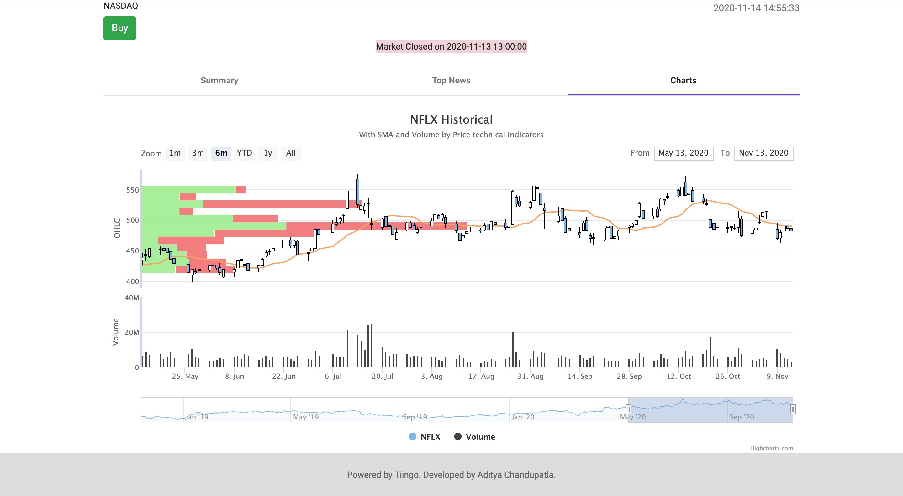

# Node, Angular and Bootstrap based Stock application (AWS)

A website developed as part of CSCI 571 - Web Technologies @ USC. This repository only contains the source code for Angular frontend. The Node backend is present here: https://github.com/adityachandupatla/node-stock-app (also the basic template/boiler-plate-code to kickstart angular development was done with [Angular CLI](https://github.com/angular/angular-cli) version 10.2.0.)

<h2>Project Goals</h2>
<ul>
  <li>Become familiar with <a href="https://angular.io/">Angular</a> (Components, Services, Binding, etc)</li>
  <li>Use <a href="https://www.typescriptlang.org/">Typescript</a> instead of Javascript to write Angular</li>
  <li>Utilise <a href="https://getbootstrap.com/">Bootstrap</a> for making the site responsive</li>
  <li>Use debounce functionality to minimise the requests sent to the backend for Search Autocomplete</li>
  <li>Show spinner while waiting for the data to be fetched</li>
  <li>Repeatedly fetch main-page data every 15 seconds so that data is accurate</li>
  <li>Store user choices in <a href="https://developer.mozilla.org/en-US/docs/Web/API/Window/localStorage">window.localStorage</a> to customise the Watchlist and Portfolio tabs</li>
</ul>

<h2>Screenshots of the developed website</h2>

Entry Page

Autocomplete Page

Main Page

Purchase Stock

Favorite Functionality

News Page

Highcharts Page

Watchlist Page

Portfolio Page

Sell stock

